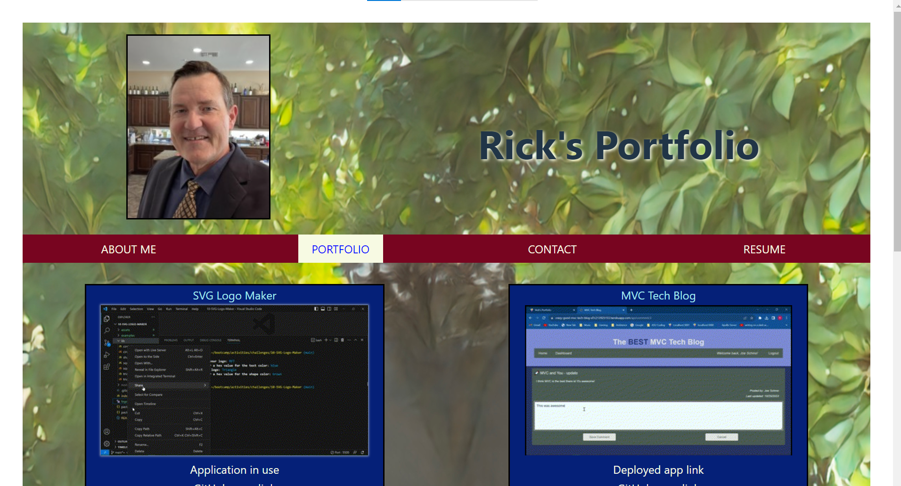
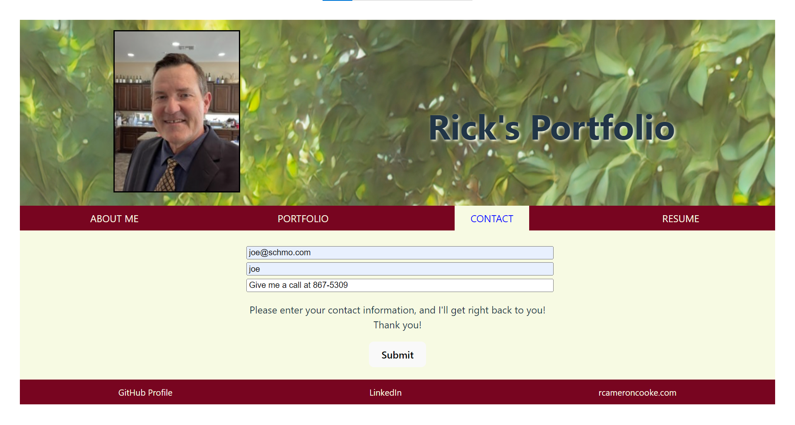
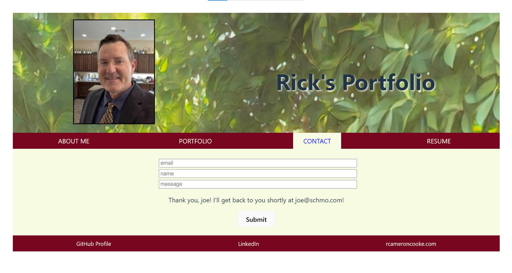
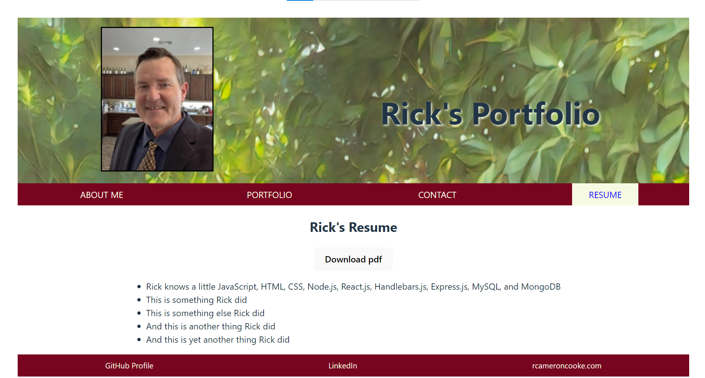

# React-Portfolio-RC

## Description
The purpose of this project is to create a portfolio using React. This application will be deployed to Netlify. Acceptance Criteria have been broken down into individual features (e.g. AC01). For details on the implementation, review the applicable 'Usage' section of this README.

### User Story

>* AS AN employer looking for candidates with experience building single-page applications
>* I WANT to view a potential employee's deployed React portfolio of work samples
>* SO THAT I can assess whether they're a good candidate for an open position

### Acceptance Criteria

>* GIVEN a single-page application portfolio for a web developer

>* AC01: Application Launch
>    -	WHEN I load the portfolio
>    -	THEN I am presented with a page containing a header, a section for content, and a footer

>* AC02: Header
>    -	WHEN I view the header
>    -	THEN I am presented with the developer's name and navigation with titles corresponding to different sections of the portfolio

>* AC03: Navigation Bar Content
>    -	WHEN I view the navigation titles
>    -	THEN I am presented with the titles About Me, Portfolio, Contact, and Resume, and the title corresponding to the current section is highlighted

>* AC04: Navigation Bar Functionality
>    -	WHEN I click on a navigation title
>    -	THEN the browser URL changes and I am presented with the corresponding section below the navigation and that title is highlighted

>* AC05: Initial Application Launch
>    -	WHEN I load the portfolio the first time
>    -	THEN the About Me title and section are selected by default

>* AC06: About Me Page Content
>    -	WHEN I am presented with the About Me section
>    -	THEN I see a recent photo or avatar of the developer and a short bio about them

>* AC07: Portfolio Page Content
>    -	WHEN I am presented with the Portfolio section
>    -	THEN I see titled images of six of the developer’s applications with links to both the deployed applications and the corresponding GitHub repositories

>* AC08: Contact Page Content
>    -	WHEN I am presented with the Contact section
>    -	THEN I see a contact form with fields for a name, an email address, and a message

>* AC09: Contact Page Required Fields Functionality
>    -	WHEN I move my cursor out of one of the form fields without entering text
>    -	THEN I receive a notification that this field is required

>* AC10: Email Validation Functionality
>    -	WHEN I enter text into the email address field
>    -	THEN I receive a notification if I have entered an invalid email address

>* AC11: Resume Page
>    -	WHEN I am presented with the Resume section
>    -	THEN I see a link to a downloadable resume and a list of the developer’s proficiencies

>* AC12: Footer Content
>    -	WHEN I view the footer
>    -	THEN I am presented with text or icon links to the developer’s GitHub and LinkedIn profiles, and their profile on a third platform (Stack Overflow, Twitter)

## Installation

> * To launch the deployed application, open the browser and paste the following URL in the address bar, or click on the link: https://silver-cannoli-22fdd0.netlify.app/
> * To access the project repo, open the browser and paste the following URL in the address bar, or click on the link: https://github.com/recenasu/React-Portfolio-RC

## Usage

>    -	To launch the application, go to the link at https://silver-cannoli-22fdd0.netlify.app/
>    -	Observe and interact with the Header, Footer, Navigation Bar, and About Me Page (AC01, AC02, AC03, AC05, AC06, AC12)
>    -  On the Navigation Bar, click on the Portfolio button and observe the Portfolio Page (AC04, AC07) 
>    -  On the Navigation Bar, click on the Contact button and observe and interact with the Contact Form (AC08, AC09, AC10)
>    -  On the Navigation Bar, click on the Resume button and observe and interact with the Resume Page (AC11)

> * The following screens show the main views of the application.

> * Screen 1

> * Screen2

> * Screen 3

> * Screen 4

> * Screen 5

## Credits

> * react v18.2.0 npm module was used for rendering the views of this SWP application.
> * vite v4.4.5 was used for building the application.
> * refer to package.json for these and any other dependencies.

